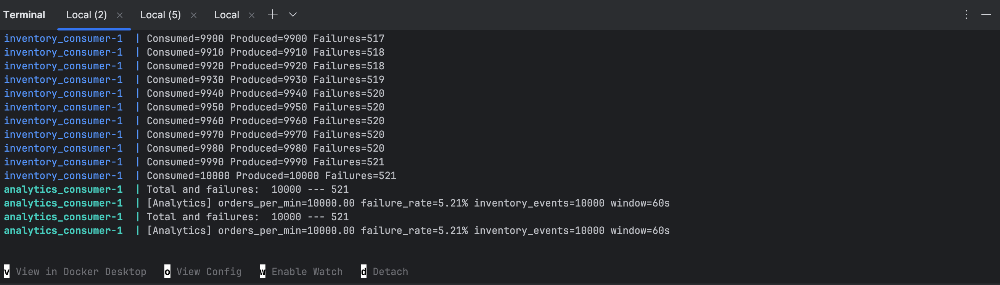
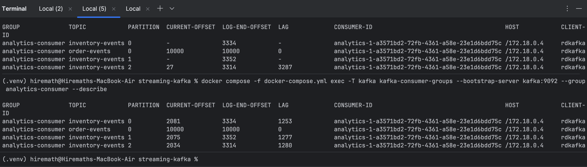
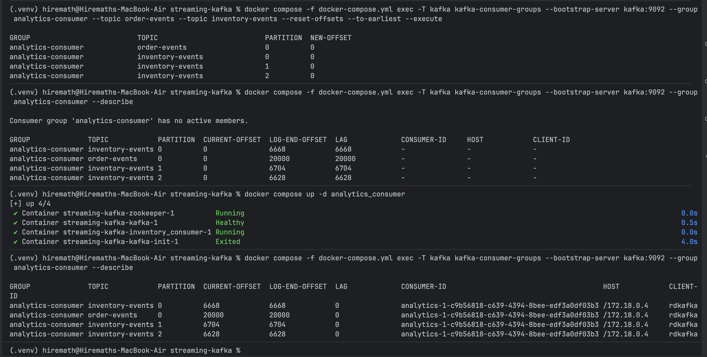
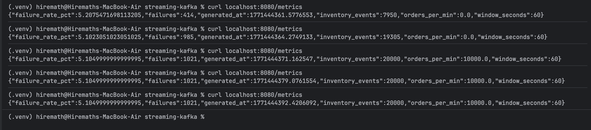

# CMPE 273 - Week 2 Assignment - Campus Food Ordering

## Part B: Async RabbitMQ 

Refer to [Async-RabbitMQ Implementation Guide](https://github.com/Manasasadhu/273-Week2-Assignment/blob/main/async-rabbitmq/README.md) for implementation information.

---

## Test Results 

### 1. Baseline Testing of All Services

**Step 1: Start all services using Docker Compose**


**Step 2: Publish 5 test orders**


**Result:** All 5 orders are successfully captured in service container logs (OrderService, InventoryService, and NotificationService).

---

### 2. Backlog & Recovery Test (60-second downtime)

**Step 1: Stop InventoryService and publish ~50 orders**


**Step 2: Backlog drain after restart**

After InventoryService restarts, queued orders are automatically processed and the queue drains back to empty:


**Result:** Messages persisted in durable queue and were automatically processed upon service restart

---

### 3. Idempotency Test (Duplicate Message Handling)

**Step 1: Create an order**


**Step 2: Check database before re-delivery**


**Step 3: Re-publish same order (same order_id) using RabbitMQ UI**


**Step 4: Check database after re-delivery**


**Result:** Database still contains only 1 row for the order_id. Inventory was NOT double-decremented

#### Idempotency Strategy Explanation

For inventory service, we used SQLite as Database to store processed orders with the order_id as PRIMARY KEY to detect duplicates. So, when a message/order arrives, we first check if the order_id already exists, if it does we skip the processing and ACK it. Else, we BEGIN a database transaction to reserve the inventory, add the processed order record and then only we ACK the RabbitMQ message. This ensures Duplicate messages are detected and skipped.

Same order_id delivered multiple times, but processed exactly once, inventory decremented exactly once.

---

### 4. DLQ & Poison Message Handling

**Step 1: Publish malformed order (missing order_id)**


**Step 2: Malformed message rejected to Dead Letter Queue**


**Result:** Malformed messages are rejected to DLQ and do not block processing of valid messages

---

## Testing for Part 3: Streaming Kafka

For the Part 3 event-streaming architecture overview, see [Streaming Kafka Architecture](streaming-kafka/README.md). The scenarios below consolidate the guidance from `streaming-kafka/Test.md` and include updated media links.

### Shared prerequisites

- Docker Desktop/Engine with Compose v2 (same as the Kafka README).
- Launch the stack from the repo root:
  ```bash
  cd streaming-kafka
  docker compose up --build
  ```
- Ensure the analytics consumer metrics endpoint is reachable at `http://localhost:8080/metrics`.

---

### 1. Producing 10k events

**Goal:** Stress the pipeline with a deterministic burst to capture baseline throughput and error rates.

1. Confirm the Kafka stack is running.
2. Trigger a one-off burst inside the producer container:
   ```bash
   cd streaming-kafka
   docker compose exec -T \
     -e MODE=burst \
     -e TOTAL_EVENTS=10000 \
     -e PRINT_EVERY=1000 \
     producer_order python -u main.py
   ```
3. Sample analytics metrics while the burst runs:
   ```bash
   curl http://localhost:8080/metrics
   ```
4. Capture artifacts:
   - Published 10k events and calculated metrics
   - 

**Expected observations**
- `orders_per_min` spikes during the burst then decays as the inventory consumer drains the backlog.
- `failure_rate_pct` tracks the `FAIL_RATE` defined in `streaming-kafka/inventory_consumer/inventory.env` (default 5%).

---

### 2. Introducing throttle in analytics consumer

**Goal:** Demonstrate how artificial processing delay surfaces as consumer lag and slower metric refreshes.

1. Edit `streaming-kafka/analytics_consumer/analytics.env` and set a throttle, e.g. `THROTTLE_MS=1`.
2. Recreate only the analytics service so offsets remain intact:
   ```bash
   cd streaming-kafka
   docker compose up --build analytics_consumer
   ```
3. Re-run the burst (or a smaller one) to generate load:
   ```bash
   docker compose exec -T producer_order python -u main.py
   ```
   - Override `TOTAL_EVENTS`, `MODE`, etc., via env vars as needed.
4. Monitor analytics metrics and Kafka lag:
   ```bash
   curl http://localhost:8080/metrics
   docker compose exec kafka kafka-consumer-groups --bootstrap-server kafka:9092 --describe --group analytics-consumer
   ```
5. Capture artifacts:
   - Consumer lag for analytics-consumer group
   - 

**Expected observations**
- `/metrics` updates every `REPORT_INTERVAL_SEC`, but values lag because each event sleeps `THROTTLE_MS`.
- Kafka `Lag` for `analytics-consumer` increases during the burst and drains slowly afterward.
- Inventory consumer remains healthy, so the backlog accumulates only on the analytics side.

**Reset:** Restore `THROTTLE_MS=0`, then restart analytics to return to baseline behavior.

---

### 3. Resetting offsets, replaying events, and comparing metrics

**Goal:** Verify deterministic replay behavior by rewinding the analytics consumer to reprocess historical events.

1. Stop the analytics consumer to avoid races (optional but cleaner):
   ```bash
   cd streaming-kafka
   docker compose stop analytics_consumer
   ```
2. Reset offsets for both topics consumed by the analytics group:
   ```bash
   docker compose exec kafka kafka-consumer-groups \
     --bootstrap-server kafka:9092 \
     --group analytics-consumer \
     --topic order-events \
     --topic inventory-events \
     --reset-offsets --to-earliest --execute
   ```
3. Restart analytics and ensure it rejoins:
   ```bash
   docker compose start analytics_consumer
   ```
4. Replay the workload by re-running the same burst command from test #1 (adjust `TOTAL_EVENTS` as needed) and sample metrics for comparison.
5. Capture artifacts:
   - Consumer offset reset before and after
   - 
   - Metrics calculated after replay (slightly different due to 20k orders)
   - 

**Why metrics may match or differ**
- Deterministic aggregations (total orders processed, cumulative failure counts) converge if consumers remain idempotent.
- Rate-based metrics (`orders_per_min`, throughput windows) depend on wall-clock sampling and often diverge because replay timing differs from the original run.
- If `FAIL_RATE` injects randomness, the replayed inventory outcomes can vary.
