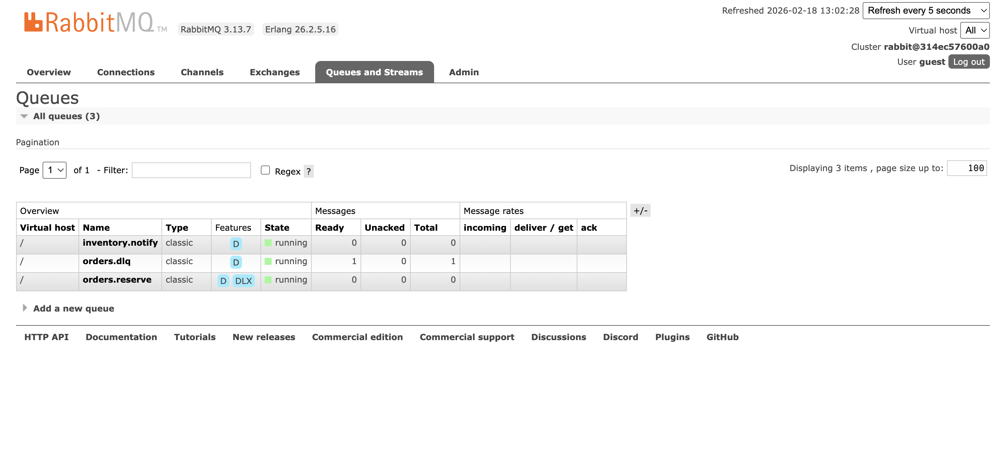

# Async RabbitMQ — Campus Food Ordering (Part B)

## Overview

- **OrderService**: publishes `OrderPlaced` events to RabbitMQ and stores orders locally in SQLite.
- **InventoryService**: consumes `OrderPlaced`, performs idempotent reserves via DB transaction, publishes `InventoryReserved` or `InventoryFailed`.
- **NotificationService**: consumes `InventoryReserved` and logs confirmations.
- **RabbitMQ broker**: durable exchanges/queues, dead-letter exchange (DLX) for poison messages.

## Architecture

### Message Flow

OrderService (HTTP /order)
    ↓ publishes OrderPlaced
RabbitMQ (orders exchange) → orders.reserve queue
    ↓ consumed by
InventoryService
    ├→ publishes InventoryReserved → inventory exchange → inventory.notify queue
    │   ↓ consumed by
    │   NotificationService (logs confirmation)
    └→ (if failed/malformed) rejected → orders.dlx → orders.dlq

## Quick Start

### 1. Build & Start Services

```bash
cd async-rabbitmq/
docker-compose up -d --build
```

Services will start with:
- RabbitMQ: `localhost:5672` (AMQP), `localhost:15672` (management UI, guest/guest)
- OrderService: `http://localhost:8001`
- InventoryService: `http://localhost:5003`
- NotificationService: no external port (logs only).

### 2. Publish Orders

```bash
python3 tests/publish_orders.py
```

Then check logs:

```bash
docker-compose logs -f inventory-service
docker-compose logs -f notification-service
```

Expected output: orders reserved, inventory decremented, notifications logged.

### 3. Endpoints

| Endpoint | Method | Purpose |
|----------|--------|---------|
| `POST /order` | OrderService | Create order: `{ "item": "burger", "qty": 1 }` → publishes OrderPlaced |
| `GET /health` | All services | Health check |
| `POST /configure` | InventoryService | Runtime fault injection: `{ "delay": 2.0, "failure_rate": 0.1 }` |

## Tests

### Test 1: Backlog & Recovery (60s downtime)

```bash
bash tests/backlog_test.sh
```

**What it does:**
1. Stops InventoryService.
2. Publishes 50 orders (accumulate in `orders.reserve` queue).
3. Checks queue depth every 5s (e.g., `48 messages`).
4. Starts InventoryService.
5. Monitors queue drain back to 0 (shows `inventory-service` processing backlog).
6. Displays InventoryService logs showing order processing.

### Test 2: Idempotency (duplicate message)

**What it does:**
1. Publishes order (e.g., `ORD-ABC123`).
2. Publishes the same `order_id` again (simulates re-delivery).
3. Queries `InventoryService` DB table `processed_orders` to verify only 1 row exists for that `order_id`.
4. Checks inventory levels (should show `qty` decreased by 1, not 2).

**Result**: DB row count = 1, inventory qty decremented by 1.

**Idempotency Mechanism:**
- InventoryService checks `processed_orders` table inside DB transaction.
- If `order_id` exists → log duplicate, ACK message (exit early, no reserve).
- Else → perform reserve, insert row, commit, then ACK.
- ACK only after commit → no duplicate reserves on retries.

### Test 3: DLQ (poison message)

**What it does:**
1. Publishes malformed OrderPlaced (missing `order_id`).
2. Publishes invalid JSON (syntax error).
3. InventoryService validates; on failure calls `channel.basic_reject(requeue=False)`.
4. RabbitMQ routes rejected messages to `orders.dlx` → `orders.dlq`.
5. Script checks queue depth of `orders.dlq` to confirm messages landed.

**Result**: `orders.dlq` queue contains 2+ messages, InventoryService logs show "Malformed message — rejecting to DLQ".

## Observability

### RabbitMQ Management UI

Open `http://localhost:15672` (guest/guest) to:
- View queue depths (`Queues` tab).
- Check message rates (graph in `Overview`).
- Inspect DLQ contents.


### Direct DB Inspection

```bash
docker-compose exec inventory-service sqlite3 /data/inventory.db \
  "SELECT order_id, reservation_id, status FROM processed_orders LIMIT 10"

docker-compose exec inventory-service sqlite3 /data/inventory.db \
  "SELECT item, qty FROM inventory"
```

## Failure Injection (Runtime)

Test resilience with fault injection on InventoryService:

```bash
curl -X POST http://localhost:5003/configure \
  -H "Content-Type: application/json" \
  -d '{"delay": 2.0}'

curl -X POST http://localhost:5003/configure \
  -H "Content-Type: application/json" \
  -d '{"failure_rate": 0.5}'

curl -X POST http://localhost:5003/configure \
  -H "Content-Type: application/json" \
  -d '{"delay": 0, "failure_rate": 0}'
```

Services will process delayed/failing messages and requeue them (NACK with requeue=True) for retry.

## Cleanup

```bash
docker-compose down -v
```

Removes all containers and volumes (data reset).
